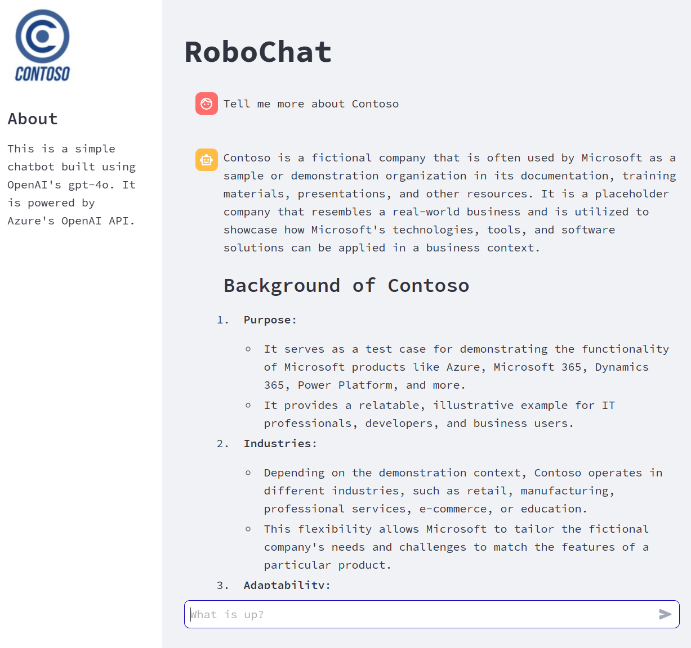

# barebone-chat-app

## 🚀 Introduction
This is a very basic starter template intended to speed up the development of chatbot applications using Large Language Models (LLMs). It provides a minimal setup to get you started quickly with building and deploying your chatbot.

## 📸 Demo


## 🛠️ Local Development
To set up the project locally, follow these steps:

1. **Clone the repository:**
    ```bash
    git clone https://github.com/yourusername/barebone-chat-app.git
    cd barebone-chat-app
    ```

2. **Set up a virtual environment:**
    ```bash
    python -m venv venv
    source venv/bin/activate  # On Windows use `venv\Scripts\activate`
    ```

3. **Install dependencies:**
    ```bash
    pip install -r requirements.txt
    ```

4. **Start the development server:**
    ```bash
    streamlit run frontend/chat_component.py
    ```

5. **Open your browser:**
    Navigate to the URL provided by Streamlit to see the application in action. 🚀

## Setting up the Environment

1. Copy the `.sample.env` file to a new file named `.env`.
2. Set each variable in your `.env` file according to your Azure services and storage configurations.

## Creating the Search Index

The script available at `/app/search/main.py` will create the index. Once the index is created, you can query it using the `search_wrapper`'s `search` function.

## Example Data Source

For this example, data is taken from:
[https://github.com/Azure-Samples/azure-search-sample-data/tree/main/ny-philharmonic/ny-philharmoni-full](https://github.com/Azure-Samples/azure-search-sample-data/tree/main/ny-philharmonic/ny-philharmoni-full)

## Blob Upload

`blob_wrapper` will upload the JSON file to your Azure Blob Storage if you set the path to the corresponding directory in your `.env` file. 
> **Note:** Since the indexer parameter is set to JSON array, only one JSON source file will be considered during indexing. We recommend uploading only "complete.json" for this example.

Enjoy building your chatbot! 🤖✨